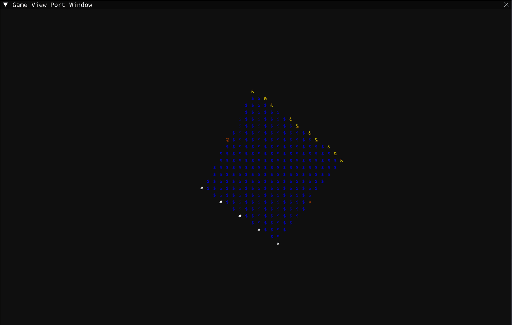
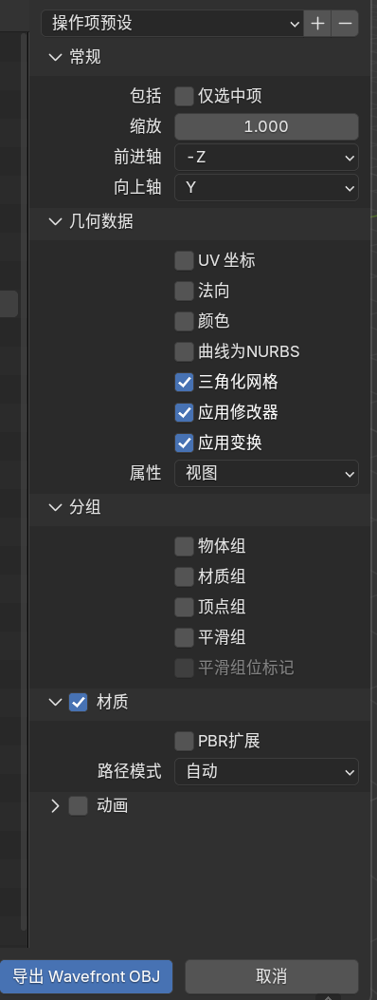

# Cube Simulator


### 介绍

Cube Simulator 是一个类终端风格的简易3D场景渲染器，用 C++20 编写，你可以添加任意数量的模型对象到场景当中，随意的调整他们的姿态，然后用摄像机自由的观察它们，特别适合用来制作ASCII-art风格的动画甚至游戏。

### 演示



### 构建

要求安装Vulkan的SDK：[LunarXchange](https://vulkan.lunarg.com/)

构建系统使用CMake，执行下列命令：

```
git clone https://github.com/XiaoXueTu555/cube_simulator.git
cd cube_simulator/
cmake -S ./ -B Build
cmake --build Build/
./Build/cube_simulator
```

### 模型准备

目前仅支持OBJ格式的模型文件，且必须要按照如下设置导出：

用Blender建模之后，导出设置如下：



Cube Simulator还需要一个材质名到ASCII字符的映射，所以还需要准备一个 .yaml 文件，内容格式如下：

```
# 统一格式
材质名 : ASCII字符

# 例如
RED : @
GREEN : *
BLUE : &
```

导入时，输入obj和yaml文件的路径，程序会根据obj里编码的mtl路径自动加载mtl文件。

导入后即可愉快的玩耍了，记得看Help文本，祝你玩的开心。

[](https://www.star-history.com/#XiaoXueTu555/cube_simulator&Date)
